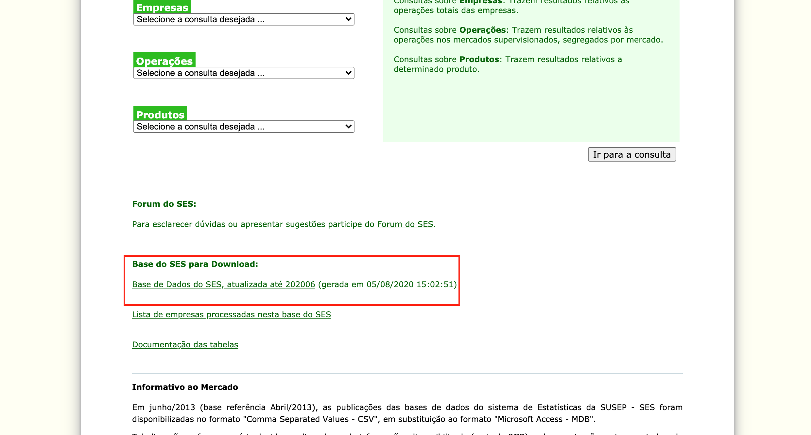

## 3 thing that Covid changed in the Brazilian insurance market

### 1. Installations
  For this analysis I a used anaconda distribution and the downloaded files of SUSEP (http://www2.susep.gov.br/menuestatistica/SES/principal.aspx).
  To download the files, click in the link, scroll the page until you find the download link like in the image below:
  

### 2. Motivation
  This analyze is motivated by my Udacity nanodegree of Data Scientist. The theme for the project was based in my field of work which is life insurance.
  
### 3. File Descriptions
  The only file in this git is the jupyter notebook with the code and instructions for the gather, cleaning and plotting steps I took to write my article 
  at Medium.
  
### 4. How to Use this Notebook
  You should download the files from SUSEP and add the path of the folder you saved in the second code cell of the notebook. After that, feel free to run 
  each cell as you wish and on your own time.

### 5. Licensing, Authors, Acknowledgements, etc.
  Special thanks to the stack overflow community.
